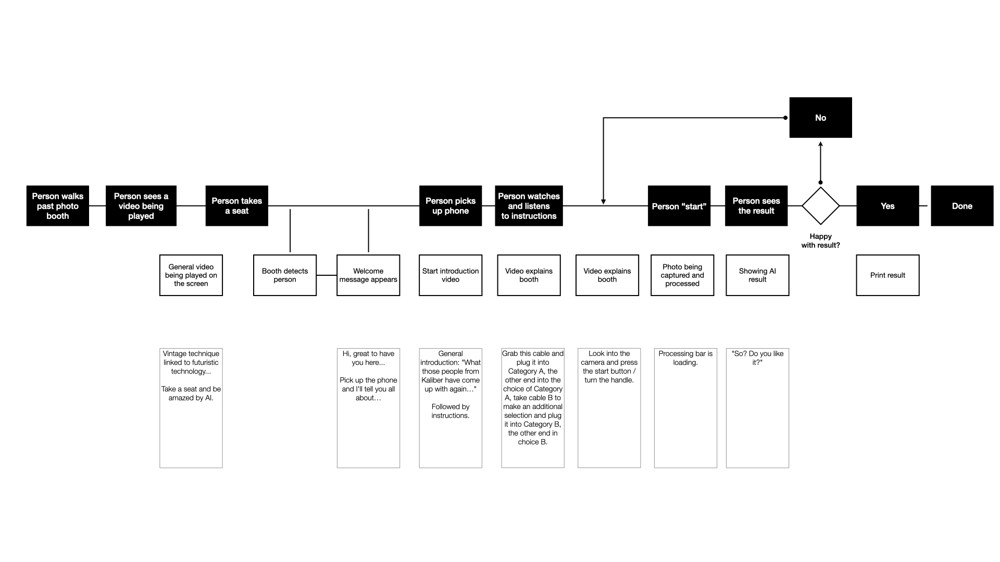

# Kaliber Snap-a-tron Ultra 2000 Deluxe
> Transform a Polaroid into a Van Gogh portrait: thanks to AI, this 1960 photo booth can do it!

[](https://opensource.org/licenses/MIT)

**Note: This project is provided "as-is" and does not include any support.**

## Introduction

Welcome to the Kaliber Snap-a-tron Ultra 2000 Deluxe project! This unique machine allows you to turn an ordinary Polaroid into a stunning Van Gogh-style portrait, all powered by cutting-edge AI technology.

Initially, we began this journey by using a external service for Stable Diffusion called [Runpod](https://www.runpod.io/). However, to achieve our goal of operating the machine offline, we transitioned to utilizing a local instance of Stable Diffusion. This change allowed us to maintain full control over the process and operate the photo booth without the need for an internet connection.

## Setup (Development)

1. Run `yarn`.
2. Create a `config/local.js` file (for development purposes only) and configure the Arduino section accordingly.

## Application Flow
We have outlined a detailed flow of this application.


## Websocket Service
Communication between the website, Arduino devices, and the Stable Diffusion API is facilitated through websockets. You can start this service using the following command: `yarn websocket-service.prd`.

## Arduino
Arduino ports may vary depending on the system and even each time you connect the Arduino. To manage this, it's recommended to create a `config/local.js` file where you can define the port configurations:

```javascript
module.exports = {
  server: {
    arduino: {
      input: {
        port: '/dev/cu.usbmodem14101'
      },
      phone: {
        port: ''
      }
    }
  }
}
```

## Fake Data
Data is received via serial sockets and transmitted from node to the browser through a websocket. For local testing, you can utilize the `fake-websocket-service`. Start it using the command: `node services/fake-websocket-service.js`.

# Running on Windows
Running the application on Windows requires specific steps, especially for development:

- Stable Diffusion 1.5 (Windows)
- Node.js 16 (Windows) => Required for running the websocket service
- WSL (= Ubuntu) => Used for serving the frontend (UI)
- Task Scheduler for automated task management

### Node.js 16 (Back-end)
To run `yarn websocket-service.prd` on a Windows computer, you need to install Node.js 16 along with additional tools. This will also install Visual Studio Code tools and Python, which are required (otherwise, you might encounter errors during `yarn` related to `node-gyp`).

### Stable Diffusion 1.5
To use Stable Diffusion 1.5, several prerequisites need to be installed beforehand:
- Python 3.10
- Git Bash

1. Clone the repository: `git clone https://github.com/AUTOMATIC1111/stable-diffusion-webui.git`
2. Place the model `https://huggingface.co/runwayml/stable-diffusion-v1-5/resolve/main/v1-5-pruned-emaonly.ckpt` in the directory `%userprofile%\stable-diffusion-webui\models\Stable-diffusion`.
3. Modify the file `webui-user.bat` in the directory `%userprofile%\stable-diffusion-webui\`:
   ```shell
   export COMMANDLINE_ARGS="--xformers --listen --enable-insecure-extension-access --api --api-auth \"user:password\"`
   ```
4. Add the ControlNet extension via WebUI: [sd-webui-controlnet](https://github.com/Mikubill/sd-webui-controlnet).
5. Add the ControlNet models in the directory `%userprofile%\stable-diffusion-webui\extensions\sd-webui-controlnet\models`:
   5.1. Canny: `https://huggingface.co/lllyasviel/ControlNet-v1-1/resolve/main/control_v11p_sd15_canny.pth`
   5.2. Depth: `https://huggingface.co/lllyasviel/ControlNet-v1-1/resolve/main/control_v11f1p_sd15_depth.pth`

### WSL
In our case, an Ubuntu 22.04 installation was used, with Node.js 16 and Git installed. Necessary packages like ImageMagick have also been installed (following the basic steps from the development workbook).

### Task Scheduler
The Task Scheduler can be used to initiate application tasks. Four "tasks" have been created. Configuration files can be found in the `task_scheduler` directory.
